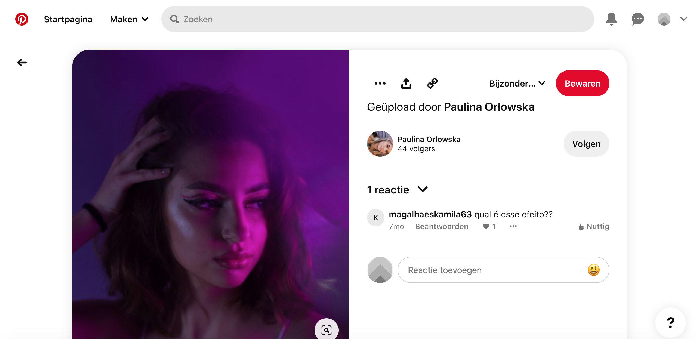
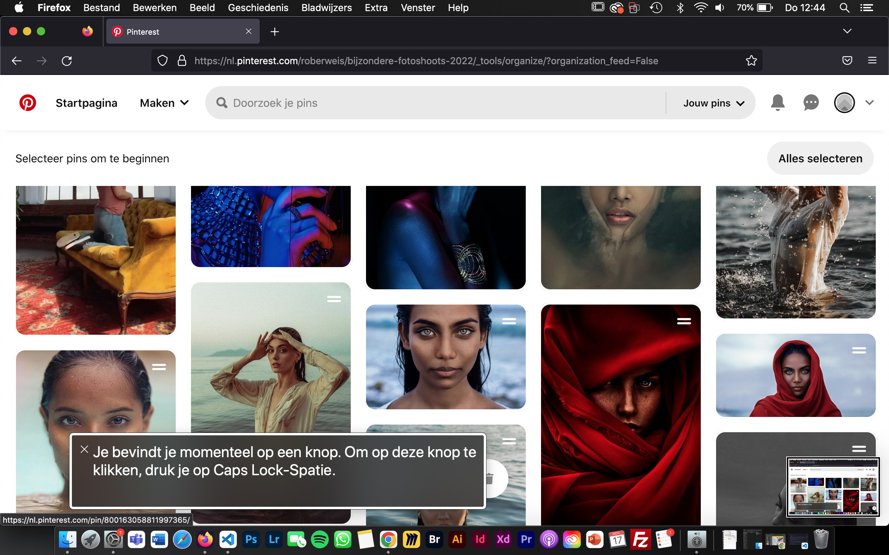
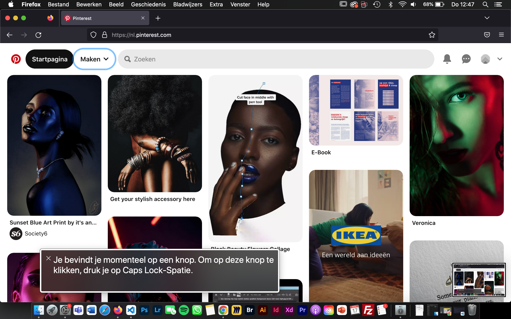
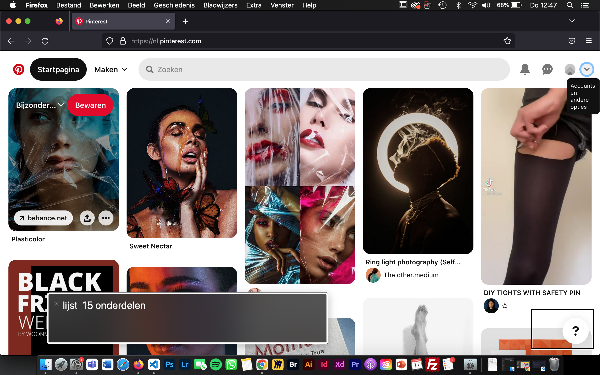
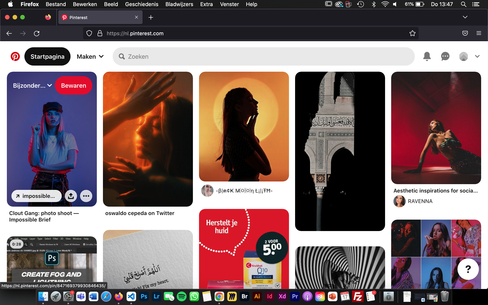
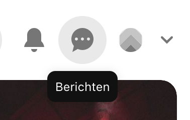
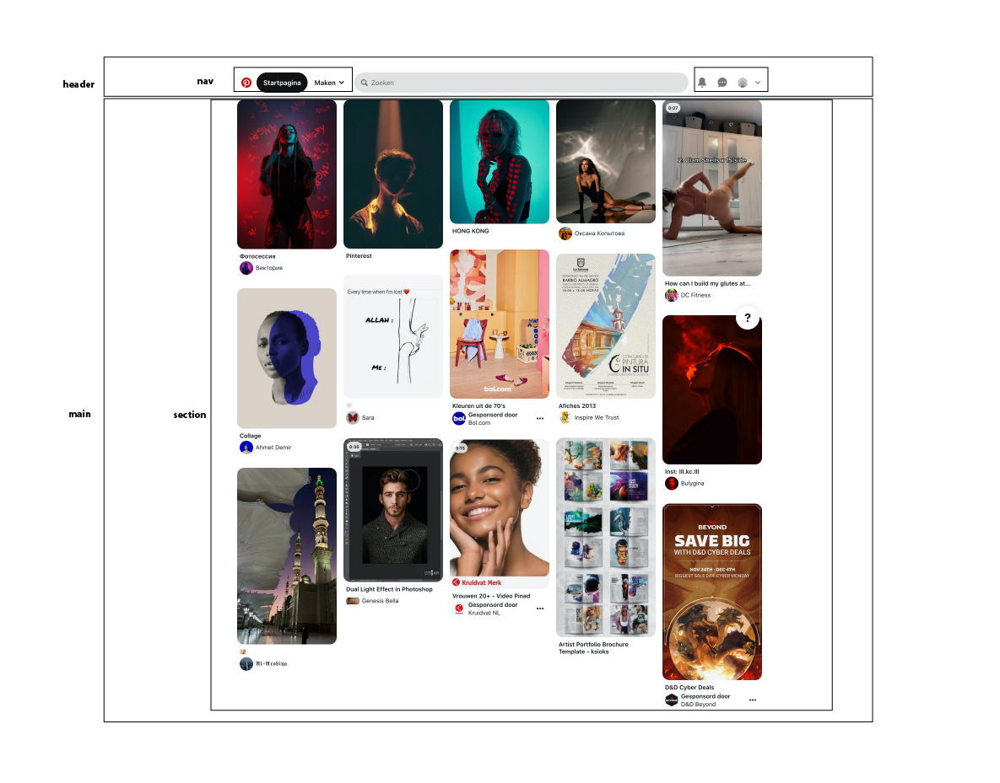
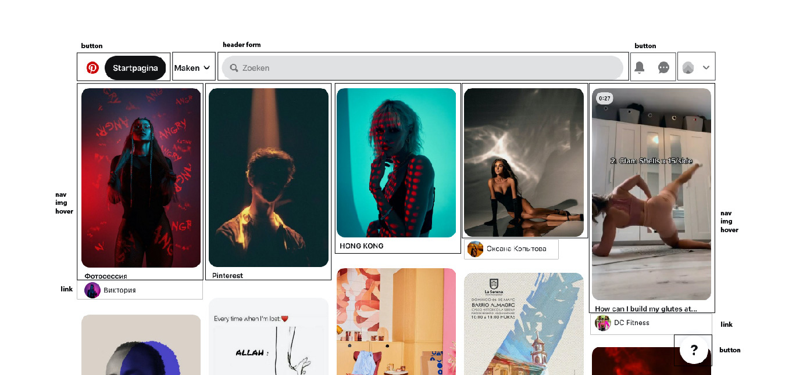

# Procesverslag
Markdown is een simpele manier om HTML te schrijven.  
Markdown cheat cheet: [Hulp bij het schrijven van Markdown](https://github.com/adam-p/markdown-here/wiki/Markdown-Cheatsheet).

Nb. De standaardstructuur en de spartaanse opmaak van de README.md zijn helemaal prima. Het gaat om de inhoud van je procesverslag. Besteedt de tijd voor pracht en praal aan je website.

Nb. Door *open* toe te voegen aan een *details* element kun je deze standaard open zetten. Fijn om dat steeds voor de relevante stuk(ken) te doen.

## Jij

  
uitwerken voor kick-off werkgroep

  ### Auteur:
  Rouicha Oberweis

  #### Je startniveau:
  blauw

  #### Je focus:
  focus: responsiveb
 

## Je website

  
uitwerken voor kick-off werkgroep

  ### Je opdracht:
  https://nl.pinterest.com/

  #### Screenshot(s) van de eerste pagina (small screen): 
  Pinterest  
  

  #### Screenshot(s) van de tweede pagina (small screen):
  hier de naam van de pagina  
  
 

## Toegankelijkheidstest 1/2 (week 1)

  
uitwerken na test in 1e werkgroep

  ### Bevindingen
  Bevindingen screen reader:
  Tijdens het testen, merkte ik dat Pinterest de afbeeldingen op de startpagina als link beschreef en gaf geen uitleg over hoe de afbeelding eruit zag.
  Ook drukte ik perongeluk een keer te veel op tab. Het was voor mij niet duidelijk hoe ik nu terug zou kunnen navigeren.
  Je moet alle reacties nagaan met de screenreader om naar de gerelateerde afbleedingen te gaan. Dit kost veel tijd en geduld. Het zou makkelijker zijn als je de reacties open kon klikken als je daar geintresseerd in bent. Nu moet je alles nagaan, ondanks je daar geen interesse in hebt.
  De knoppen worden niet goed uitgelegd. Er staat alleen het woord knop en niet wat de knop doet.
  De volgorde van het oplezen van de content is niet van links naar rechts. Het begint in het midden en gaat dan naar links. Daarna leest het de informatie die links op de pagina staat.
  Het is moeilijk om voorbij de advertenties te navigeren, omdat die veel link knoppen hebben, waar je voorbij moet navigeren.
  Er wordt aangeven dat je op een link staat, maar niet waar de link naar lijdt.
  Het geeft 6w aan en niet letterlijk 6 weken. Dit kan nogal verwarrend overkomen.

  Bevindingen met muis/toetsenbord:
  Met tab komt er een hele subtiele blauwe rand om de content/knoppen heen. Het is zo subtiel, dat het moeilijk is om het te volgen. Vooral wanneer het om de afbeeldingen gaat. Dat is het niet meer te volgen welke afbeelding geslecteerd is.
  Niet alle knoppen werken met Tab. 
  Geen logische volgorde om in te navigeren met Tab.
  Spatie heeft steeds een andere werking. Zodra je weet hoe dit werkt, werkt dit erg prettig.
  Wanneer je over de knoppen heen hovert met je muis, geeft het aan wat de knop is. Dit vind ik erg goed en maakt het duidelijker. 
  Wanneer je over de content heen hovert, komen er verschillende opties te voor schijn. Klik je erop, dan kom je op de detailpagina van de afbeelding. Hier zie je de afbeelding groot, titel, en heel soms een kleine beschrijving.

  Bevindingen kleuren:
  Het viel me op dat de website er echt heel anders uitzag wanneer je contrast en pronotapie ging veranderen. Hierdoor realiseer ik me dat het contrast hoog moet zijn, zodat mensen die al weinig contrast zien, nog in ieder geval iets van contrast kunnen zien.

  #### Screenreader
  Hier korte omschrijving (met indien nodig afbeeldingen)
    
    
    

  Met de screenreader navigeerde door de volledige pagina. Ik merkte dat dit anders ging dan verwacht.

  Tijdens het testen, merkte ik dat Pinterest de afbeeldingen op de startpagina als link beschreef en gaf geen uitleg over hoe de afbeelding eruit zag. Dit zou ik kunnen oplossen met een goede alt tekst. Soms hadden de knoppen een goede uitleg en soms werd het alleen als knop beschreven. Dit kan heel verwarrend zijn voor de gebruiker. Dit wil ik graag beter doen.

  Ook zou ik teksten volledig uitschrijven en geen afkortingen gebruiken, omdat dit nogal vaag kan zijn.

  #### Muis en Toetsenbord 
  Hier korte omschrijving (met indien nodig afbeeldingen)
    
    

  Lijst met je bevindingen die in de test naar voren kwamen:
  Ik merkte dat het lastig was om te zien welke content geselecteerd werd met tab. Daarom wil ik betere feedback geven. Dit kan al heel makkelijk door de rand iets dikker te maken, zodat het meer opvalt. Ook kan het met een fellere kleur.
  Met het toetsenbord navigeer je vooral naar de advertenties. Dit is juist niet wat je wilt als gebruiker. Ik zou mijn ontwerp gebruikersvriendelijker willen maken, door dit juist te vermijden.
  Net als bij Pinterest wil ik ook een kleine beschrijving plaatsen wanneer je over een knop hovert. 

  #### Motoriek (shocks, elastiekjes)
  Hier korte omschrijving (met indien nodig afbeeldingen):
  Helaas was ik ziek tijdens de les, dus ik kon niet bij het materiaal om deze opdracht te doen. Ik heb wel geprobeerd om met een elastiekje om mijn vingers te binden en dat de website door te nemen. Dit ging iets moeilijker met typen, maar het scrollen ging prima. Gelukkig hoef je bij Pinterest niet veel te typen. 
  Met concentratie problemen, was dit ook best lastig, maar op pinterest zitten gelukkig veel prikkels, waardoor je je aandacht er wel bij kan houden.

  #### Visueel (brillen, contrast, kleurenblind, dark/light). 
  De website van pinterest heeft geen dark modus. De app variant daarentegen wel. Alleen de achtergrond veranderd van kleur. De afbeeldingen vullen 90% van de pagina op, dus de dark modus valt bij de app niet erg op.
  Belangrijk om contrast hoog te maken en rekening te houden met mensen die geen kleuren zien.

## Breakdownschets (week 1)

  
uitwerken na afloop 2e werkgroep

  ### de hele pagina: 
  

  ### dynamisch deel (bijv menu): 
  

## Voortgang 1 (week 2)

  
uitwerken voor 1e voortgang

  
  
  

  ### Stand van zaken
  hier dit ging goed & dit was lastig 

  ### Agenda voor meeting
  samen met je groepje opstellen
  Ik stelde voor om de tijd te verdelen door drieeën, zodat wij allemaal onze eigen dingen kunnen doen, zonder dat dat we iemand er doorheen gaat en jij je antwoord nog steeds niet hebt.

  | Rouicha        | Beau               | Ufuk         
  | ---            | ---                | ---          
  | bewaren knop & | geen vragen        | vragen hoe hij bepaalde 
  | JavaScript     |                    | elementen op één plek k
  | onduidelijk    |                    | on zitten en responsive kon maken

  ### Verslag van meeting
  hier na afloop snel de uitkomsten van de meeting vastleggen

  - Ik heb javascript nodig om de tekst te veranderen in de html
  - de website is nog te simpel
  - Het is mogelijk om knoppen boven de afbeeldingen te zetten

## Voortgang 2 (week 3)

  
uitwerken voor 2e voortgang

  ### Stand van zaken
  hier dit ging goed & dit was lastig (neem ook screenshots op van delen van je website en code)

  ### Agenda voor meeting
  samen met je groepje opstellen

  | Rouicha        | Beau               | Ufuk         
  | ---            | ---                | ---          
  | feedback vragen| hoe hij semantisch | vragen hoe hij responsive kon maken  
  | Hoe nu verder? | correct kan werken | + ingewikkelde code 
  | onduidelijk    | + hoe krijgt hij de| + ahref link hoeft geen p element
                     tekst goed op een 
                     foto

  ### Verslag van meeting
  hier na afloop snel de uitkomsten van de meeting vastleggen

  - Op de detail pagina kan ik de toegankelijkheid verbeteren door de reacties uit in te kunnen klappen, door 'detail summary' te gebruiken.
  - Tweede pagina responsive maken
  - Bovenste gedeelte article, img, div, knoppen + titel + tekst. Onderste gedeelte section: titel img.
  - Tweede pagina > onderste gedeelte dezelfde manier stijlen zoals op de homepagina

## Toegankelijkheidstest 2/2 (week 4)

  
uitwerken na test in 8e werkgroep

  ### Bevindingen
  Lijst met je bevindingen die in de test naar voren kwamen (geef ook aan wat er verbeterd is):

  #### Screenreader
  Hier korte omschrijving (met indien nodig afbeeldingen)

  Hier een omschrijving van hoe het opgelost kan worden (met indien nodig afbeeldingen)

  #### Muis en Toetsenbord 
  Hier korte omschrijving (met indien nodig afbeeldingen)

  Hier een omschrijving van hoe het opgelost kan worden (met indien nodig afbeeldingen)

  #### Motoriek (shocks, elastiekjes)
  Hier korte omschrijving (met indien nodig afbeeldingen)

  Hier een omschrijving van hoe het opgelost kan worden (met indien nodig afbeeldingen)

  #### Visueel (brillen, contrast, kleurenblind, dark/light). 
  Hier korte omschrijving (met indien nodig afbeeldingen)

  Hier een omschrijving van hoe het opgelost kan worden (met indien nodig afbeeldingen)

## Voortgang 3 (week 4)

  
uitwerken voor 3e voortgang

  ### Stand van zaken
  hier dit ging goed & dit was lastig (neem ook screenshots op van delen van je website en code)

  ### Agenda voor meeting
  samen met je groepje opstellen

  | student 1      | student 2          | student 3    | student 4        |
  | ---            | ---                | ---          | ---              |
  | dit bespreken  | en dit             | en ik dit    | en dan ik dat    |
  | en dat ook nog | dit als er tijd is | nog een punt | dit wil ik zeker |
  | ...            | ...                | ...          | ...              |

  ### Verslag van meeting
  hier na afloop snel de uitkomsten van de meeting vastleggen

  - punt 1
  - punt 2
  - nog een punt
  - ...

## Eindgesprek (week 5)

  
uitwerken voor eindgesprek

  ### Je uitkomst - karakteristiek screenshots:
  

  ### Dit ging goed/Heb ik geleerd: 
  Korte omschrijving met plaatjes

  

  ### Dit was lastig/Is niet gelukt:
  Korte omschrijving met plaatjes

  

## Bronnenlijst

  
continu bijhouden terwijl je werkt

  Nb. Wees specifiek ('css-tricks' als bron is bijv. niet specifiek genoeg).

  1. https://nl.pinterest.com/
  2. https://nl.pinterest.com/pin/347551296255833717/
  3. https://nl.pinterest.com/pin/46443439899060051/
  4. https://nl.pinterest.com/pin/294845106867943683/
  5. https://nl.pinterest.com/pin/318911217373305007/
  6. https://nl.pinterest.com/pin/694961786262217132/
  7. https://nl.pinterest.com/pin/5911043257204868/
  8. https://nl.pinterest.com/pin/804244445973685479/
  9. https://nl.pinterest.com/pin/175007135511810425/
 10. https://nl.pinterest.com/pin/998251073630411158/
 11. https://nl.pinterest.com/pin/833728949788593892/
 12. https://nl.pinterest.com/pin/337910778307616632/
 13. https://nl.pinterest.com/pin/4222193392109343/
 14. https://nl.pinterest.com/pin/25192079158892487/
 15. https://nl.pinterest.com/pin/526147168979521100/
 16. https://nl.pinterest.com/pin/417990409174826429/
 

