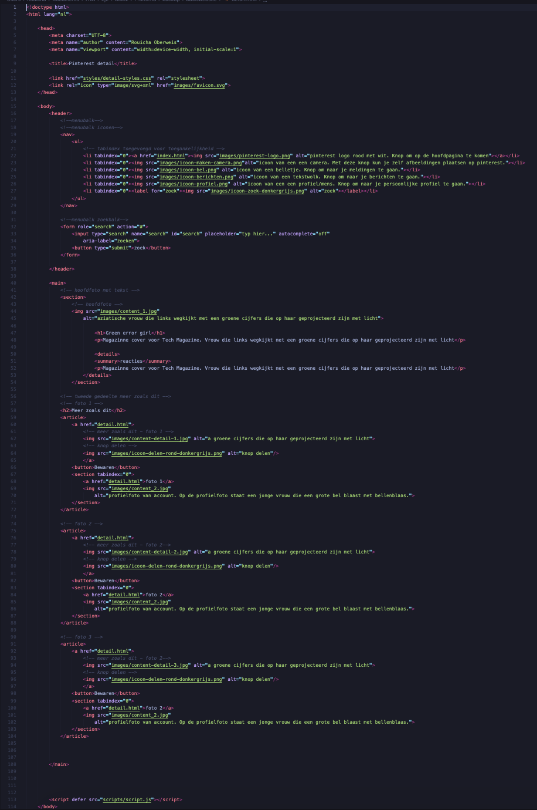
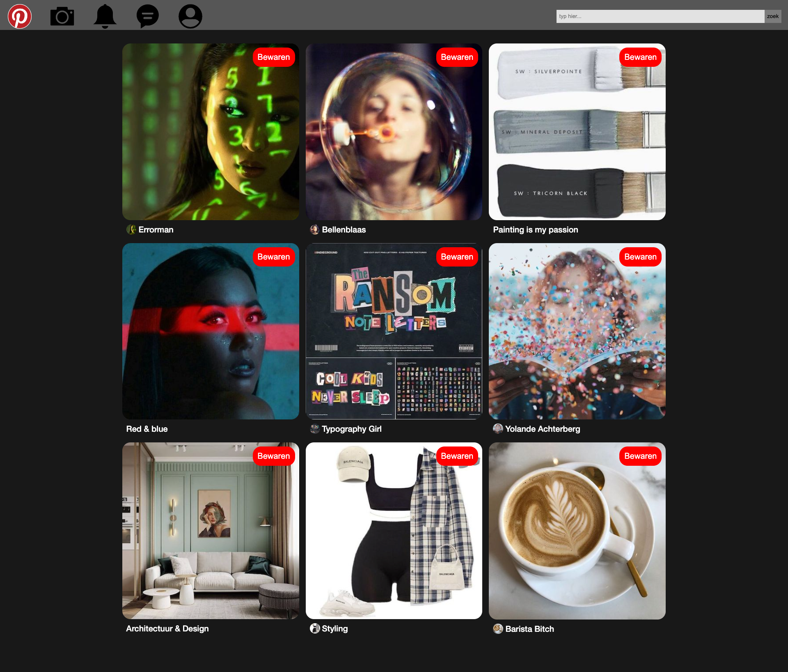
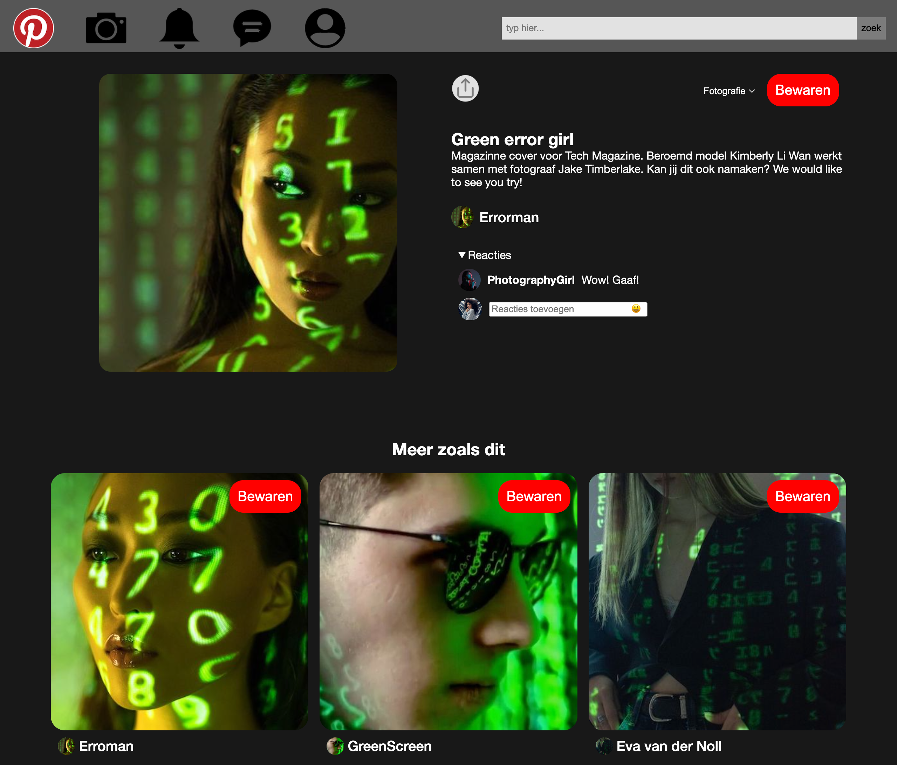
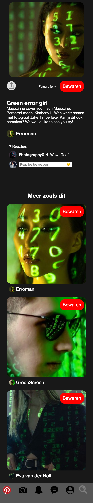

# Procesverslag
Markdown is een simpele manier om HTML te schrijven.  
Markdown cheat cheet: [Hulp bij het schrijven van Markdown](https://github.com/adam-p/markdown-here/wiki/Markdown-Cheatsheet).

Nb. De standaardstructuur en de spartaanse opmaak van de README.md zijn helemaal prima. Het gaat om de inhoud van je procesverslag. Besteedt de tijd voor pracht en praal aan je website.

Nb. Door *open* toe te voegen aan een *details* element kun je deze standaard open zetten. Fijn om dat steeds voor de relevante stuk(ken) te doen.

## Jij

  
uitwerken voor kick-off werkgroep

  ### Auteur:
  Rouicha Oberweis

  #### Je startniveau:
  blauw

  #### Je focus:
  focus: responsive
 

## Je website

  
uitwerken voor kick-off werkgroep

  ### Je opdracht:
  https://nl.pinterest.com/

  #### Screenshot(s) van de eerste pagina (small screen): 
  Pinterest  
  

  #### Screenshot(s) van de tweede pagina (small screen):
  hier de naam van de pagina  
  
 

## Toegankelijkheidstest 1/2 (week 1)

  
uitwerken na test in 1e werkgroep

  ### Bevindingen
  Bevindingen screen reader:
  Tijdens het testen, merkte ik dat Pinterest de afbeeldingen op de startpagina als link beschreef en gaf geen uitleg over hoe de afbeelding eruit zag.
  Ook drukte ik perongeluk een keer te veel op tab. Het was voor mij niet duidelijk hoe ik nu terug zou kunnen navigeren.
  Je moet alle reacties nagaan met de screenreader om naar de gerelateerde afbleedingen te gaan. Dit kost veel tijd en geduld. Het zou makkelijker zijn als je de reacties open kon klikken als je daar geintresseerd in bent. Nu moet je alles nagaan, ondanks je daar geen interesse in hebt.
  De knoppen worden niet goed uitgelegd. Er staat alleen het woord knop en niet wat de knop doet.
  De volgorde van het oplezen van de content is niet van links naar rechts. Het begint in het midden en gaat dan naar links. Daarna leest het de informatie die links op de pagina staat.
  Het is moeilijk om voorbij de advertenties te navigeren, omdat die veel link knoppen hebben, waar je voorbij moet navigeren.
  Er wordt aangeven dat je op een link staat, maar niet waar de link naar lijdt.
  Het geeft 6w aan en niet letterlijk 6 weken. Dit kan nogal verwarrend overkomen.

  Bevindingen met muis/toetsenbord:
  Met tab komt er een hele subtiele blauwe rand om de content/knoppen heen. Het is zo subtiel, dat het moeilijk is om het te volgen. Vooral wanneer het om de afbeeldingen gaat. Dat is het niet meer te volgen welke afbeelding geslecteerd is.
  Niet alle knoppen werken met Tab. 
  Geen logische volgorde om in te navigeren met Tab.
  Spatie heeft steeds een andere werking. Zodra je weet hoe dit werkt, werkt dit erg prettig.
  Wanneer je over de knoppen heen hovert met je muis, geeft het aan wat de knop is. Dit vind ik erg goed en maakt het duidelijker. 
  Wanneer je over de content heen hovert, komen er verschillende opties te voor schijn. Klik je erop, dan kom je op de detailpagina van de afbeelding. Hier zie je de afbeelding groot, titel, en heel soms een kleine beschrijving.

  Bevindingen kleuren:
  Het viel me op dat de website er echt heel anders uitzag wanneer je contrast en pronotapie ging veranderen. Hierdoor realiseer ik me dat het contrast hoog moet zijn, zodat mensen die al weinig contrast zien, nog in ieder geval iets van contrast kunnen zien.

  #### Screenreader
  Hier korte omschrijving (met indien nodig afbeeldingen)
    
    
    

  Met de screenreader navigeerde door de volledige pagina. Ik merkte dat dit anders ging dan verwacht.

  Tijdens het testen, merkte ik dat Pinterest de afbeeldingen op de startpagina als link beschreef en gaf geen uitleg over hoe de afbeelding eruit zag. Dit zou ik kunnen oplossen met een goede alt tekst. Soms hadden de knoppen een goede uitleg en soms werd het alleen als knop beschreven. Dit kan heel verwarrend zijn voor de gebruiker. Dit wil ik graag beter doen.

  Ook zou ik teksten volledig uitschrijven en geen afkortingen gebruiken, omdat dit nogal vaag kan zijn.

  #### Muis en Toetsenbord 
  Hier korte omschrijving (met indien nodig afbeeldingen)
    
    

  Lijst met je bevindingen die in de test naar voren kwamen:
  Ik merkte dat het lastig was om te zien welke content geselecteerd werd met tab. Daarom wil ik betere feedback geven. Dit kan al heel makkelijk door de rand iets dikker te maken, zodat het meer opvalt. Ook kan het met een fellere kleur.
  Met het toetsenbord navigeer je vooral naar de advertenties. Dit is juist niet wat je wilt als gebruiker. Ik zou mijn ontwerp gebruikersvriendelijker willen maken, door dit juist te vermijden.
  Net als bij Pinterest wil ik ook een kleine beschrijving plaatsen wanneer je over een knop hovert. 

  #### Motoriek (shocks, elastiekjes)
  Hier korte omschrijving (met indien nodig afbeeldingen):
  Helaas was ik ziek tijdens de les, dus ik kon niet bij het materiaal om deze opdracht te doen. Ik heb wel geprobeerd om met een elastiekje om mijn vingers te binden en dat de website door te nemen. Dit ging iets moeilijker met typen, maar het scrollen ging prima. Gelukkig hoef je bij Pinterest niet veel te typen. 
  Met concentratie problemen, was dit ook best lastig, maar op pinterest zitten gelukkig veel prikkels, waardoor je je aandacht er wel bij kan houden.

  #### Visueel (brillen, contrast, kleurenblind, dark/light). 
  De website van pinterest heeft geen dark modus. De app variant daarentegen wel. Alleen de achtergrond veranderd van kleur. De afbeeldingen vullen 90% van de pagina op, dus de dark modus valt bij de app niet erg op.
  Belangrijk om contrast hoog te maken en rekening te houden met mensen die geen kleuren zien.

## Breakdownschets (week 1)

  
uitwerken na afloop 2e werkgroep

  ### de hele pagina: 
  

  ### dynamisch deel (bijv menu): 
  

## Voortgang 1 (week 2)

  
uitwerken voor 1e voortgang

  
  
  

  ### Stand van zaken
  hier dit ging goed & dit was lastig 

  ### Agenda voor meeting
  samen met je groepje opstellen
  Ik stelde voor om de tijd te verdelen door drieeën, zodat wij allemaal onze eigen dingen kunnen doen, zonder dat dat we iemand er doorheen gaat en jij je antwoord nog steeds niet hebt.

  | Rouicha        | Beau               | Ufuk         
  | ---            | ---                | ---          
  | bewaren knop & | geen vragen        | vragen hoe hij bepaalde 
  | JavaScript     |                    | elementen op één plek kon
  | onduidelijk    |                    |  zitten en responsive kon maken

  ### Verslag van meeting
  hier na afloop snel de uitkomsten van de meeting vastleggen

  - Ik heb javascript nodig om de tekst te veranderen in de html
  - de website is nog te simpel
  - Het is mogelijk om knoppen boven de afbeeldingen te zetten

## Voortgang 2 (week 3)

  
uitwerken voor 2e voortgang

  ### Stand van zaken

  ### Agenda voor meeting
  samen met je groepje opstellen

  | Rouicha                      | Beau                                  | Ufuk         
  | ---                          | ---                                   | ---          
  | feedback vragen              | hoe hij semantisch correct kan werken | vragen hoe hij het responsive kon maken  
  | Hoe nu verder?               | + hoe krijgt hij de tekst op een foto | + ingewikkelde code 
  | onduidelijk wat ik moet doen |                                       | + ahref link hoeft geen p element

  ### Verslag van meeting
  hier na afloop snel de uitkomsten van de meeting vastleggen

  - Op de detail pagina kan ik de toegankelijkheid verbeteren door de reacties uit in te kunnen klappen, door 'detail summary' te gebruiken.
  - Tweede pagina responsive maken
  - Bovenste gedeelte article, img, div, knoppen + titel + tekst. Onderste gedeelte section: titel img.
  - Tweede pagina > onderste gedeelte dezelfde manier stijlen zoals op de homepagina

## Toegankelijkheidstest 2/2 (week 4)

  
uitwerken na test in 8e werkgroep

  ### Bevindingen
  Lijst met je bevindingen die in de test naar voren kwamen (geef ook aan wat er verbeterd is):
  Het viel me op dat ik overal een alt tekst heb neergezet, behalve bij de linkjes die naar een profiel zouden navigeren. De screenreader leest nu alleen de tekst op.

  Ik heb een duidelijke uitleg voor de meeste elementen, dit gaat goed.

  #### Screenreader
  Hier korte omschrijving (met indien nodig afbeeldingen):
  In de les gingen we onze website testen met screenreader. Hier kwam niet erg veel uit helaas, omdat ik deze testen tussen het ontwerpen door al deed.

  Lijst met je bevindingen die in de test naar voren kwamen (geef ook aan wat er verbeterd is):
  Het viel me op dat ik overal een alt tekst heb neergezet, behalve bij de linkjes die naar een profiel zouden navigeren. De screenreader leest nu alleen de tekst op.

  Hier een omschrijving van hoe het opgelost kan worden (met indien nodig afbeeldingen)
  Het is logisch dat er geen alt tekst staat, omdat daar geen alt tekst geplaats kan worden. Wat ik wel kan doen is een aria label gebruiken en hier een uitleg geven. De uitleg moet duidelijk zijn net als ik bij mijn anderen elementen op de website heb gedaan.
    

  Knoppen met duidelijke beschrijving en niet een vage uitleg, zoals de orginiele pinterest website
   

  #### Muis en Toetsenbord 
  Hier korte omschrijving (met indien nodig afbeeldingen)
  Ik heb bij de meeste elementen op de website een focus state, maar alleen bij de zoekbalk heb ik nog geen goede focus state uitgewerkt. Dit kan ik nog even aanpassen. Ik zou dit kunnen doen door een betere lijn te ontwerpen en de 'normale' focus state uit te zetten.
   

  #### Motoriek (shocks, elastiekjes)
  Hier korte omschrijving (met indien nodig afbeeldingen)
  Ik heb een ballon omhoog gehouden. Dit leidde me erg af, maar was zeker goed te doen. Op mijn website heb je niet hele erge concentratie nodig en je kan gewoon verder waar je was gebleven. Ik maak geen gebruik van grote stukken tekst, dus met een lage concentratie is mijn website goed te doen.

  #### Visueel (brillen, contrast, kleurenblind, dark/light). 
  Hier korte omschrijving (met indien nodig afbeeldingen)
  Ik heb twee verschillende brillen op mijn website gebruikt. Een andere klasgenoot heeft ook even mijn website getest. De klasgenoot gaf aan dat hij de elementen, vormen ziet, maar de context niet begrijpt.
  Ik merkte zelf dat ik het goed kon zien, behalve de subtitels (link van profiel + profielfoto).
   

   
  Hier een omschrijving van hoe het opgelost kan worden (met indien nodig afbeeldingen)
  Ik zou de subtitels groter kunnen maken, maar dan valt dit wel meer op en het moet niet de te veel aandacht trekken, omdat het niet belangrijk is.

## Voortgang 3 (week 4)

  
uitwerken voor 3e voortgang

  ### Stand van zaken
  hier dit ging goed & dit was lastig (neem ook screenshots op van delen van je website en code)
   
   

  ### Agenda voor meeting
  samen met je groepje opstellen
  
  | Rouicha                                                                 | Beau                  | Ufuk         
  | ---                                                                     | ---                   | ---          
  | feedback vragen                                                         | knop animatie geven   | feedback
  | hulp om hoe ik dezelfde stijl bij mijn andere html pagina kon krijgen   |                       | + ingewikkelde code 
 

  ### Verslag van meeting
  hier na afloop snel de uitkomsten van de meeting vastleggen

  - Ik liep nogal vast met mijn code. Ik wilde dezelfde css toepassen in mijn andere HTML, maar dit ging niet goed. Ymaro heeft me geholpen. Nu ging het wel goed en moest ik zelf nog even wat dingen aanpassen.
  - Helaas was er geen tijd om feedback te vragen, want het duurde al best lang

## Eindgesprek (week 5)

  
uitwerken voor eindgesprek

  ### Je uitkomst - karakteristiek screenshots:
  
  
  
  

  

   
   

  ### Dit ging goed/Heb ik geleerd: 
  Wat heb ik geleerd:
  Ik heb geleerd dat je met CSS veel meer kan dat ik in eerste instatie dacht. Ik heb geleerd hoe ik een website responsive kan maken, meer manieren om geen divs/classes te gebruiken, semantisch correct te werken, animaties te maken en hoe ik het beste mijn website kan testen.

  Wat ging er goed:
  Ik vond de eerste opdrachten van het huiswerk, vaak goed gaan. De tweede lukte niet altijd. Ook vond ik het testen en vooronderzoek goed gaan. Ik bedoel hiermee dat ik echt keek naar wat de gebruiker nodig heeft en dat ik inclusief probeerde te ontwerpen.
  Ik heb ook geleerd om rustiger te blijven tijdens het coderen. Ik ervaarde iets minder irritaties, omdat ik nu wel weet dat coderen met ups en downs gaat. Ik probeer nu iets eerder aan de bel te trekken, voordat ik mijn laptop uit het raam wil gooien ;p

   

  ### Dit was lastig/Is niet gelukt:
  Korte omschrijving met plaatjes
  Opdracht twee van huiswerkopdrachten. Dit ging vaak niet goed. Ook ging het toepassen van de theorie in het begin niet zo vlot. Met wat hulp, ging dit weer goed.
   

## Bronnenlijst

  
Bronvermelding

  1. https://nl.pinterest.com/
  2. https://nl.pinterest.com/pin/347551296255833717/
  3. https://nl.pinterest.com/pin/46443439899060051/
  4. https://nl.pinterest.com/pin/294845106867943683/
  5. https://nl.pinterest.com/pin/318911217373305007/
  6. https://nl.pinterest.com/pin/694961786262217132/
  7. https://nl.pinterest.com/pin/5911043257204868/
  8. https://nl.pinterest.com/pin/804244445973685479/
  9. https://nl.pinterest.com/pin/175007135511810425/
 10. https://nl.pinterest.com/pin/998251073630411158/
 11. https://nl.pinterest.com/pin/833728949788593892/
 12. https://nl.pinterest.com/pin/337910778307616632/
 13. https://nl.pinterest.com/pin/4222193392109343/
 14. https://nl.pinterest.com/pin/25192079158892487/
 15. https://nl.pinterest.com/pin/526147168979521100/
 16. https://nl.pinterest.com/pin/417990409174826429/
 17. https://nl.pinterest.com/pin/774124928093140/
 18. https://nl.pinterest.com/pin/194780752620586702/
 19. https://nl.pinterest.com/pin/8373949299805513/
 20. https://nl.pinterest.com/pin/563018695607984/
 21. https://nl.pinterest.com/pin/966233295030717776/
 22. https://nl.pinterest.com/pin/492933121727320424/
 23. https://nl.pinterest.com/pin/479914904052148585/
 24. https://nl.pinterest.com/pin/279504720615165377/
 25. https://nl.pinterest.com/pin/422281208742400/
 26. https://nl.pinterest.com/pin/4433299626606221/
 27. https://nl.pinterest.com/pin/635992778643442666/
 

